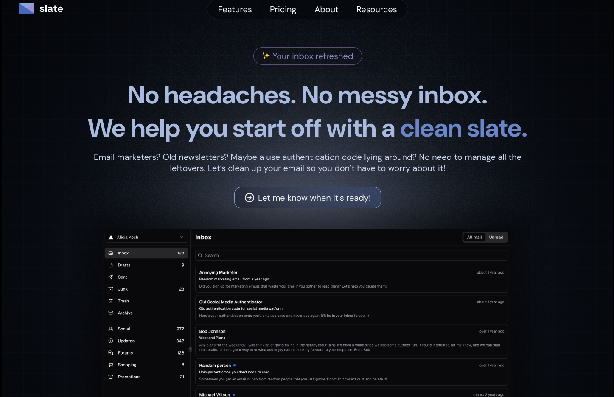
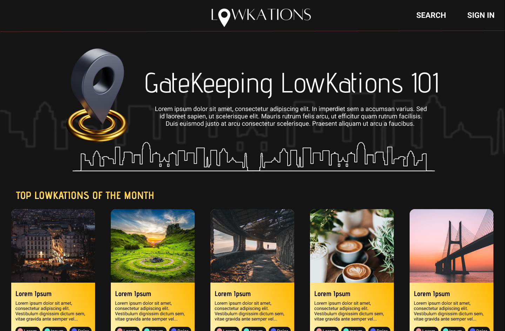

# Figma Designs &amp; prototypes

### Slate

A website design for an email cleaning extension that helps users organize and remove clutter from their inbox.  
[Figma Prototype](https://www.figma.com/proto/YjZpOBTyLVvda9iFOERXWf/Slate?node-id=0-4300&p=f&t=QPP4hoiOZ4IlNa8S-1&scaling=min-zoom&content-scaling=fixed&page-id=0%3A1)

---

### Lowkations

A web app where users can share hidden or unique locations around the world, and explore contributions from others.  
[Figma Prototype](https://www.figma.com/proto/L6cTNDF0uzZsYEYaR2IOn7/LowKations?t=d5GOjZGNNQWCUb0y-1&scaling=min-zoom&content-scaling=fixed&page-id=0%3A1&node-id=3-2&starting-point-node-id=3%3A2)
